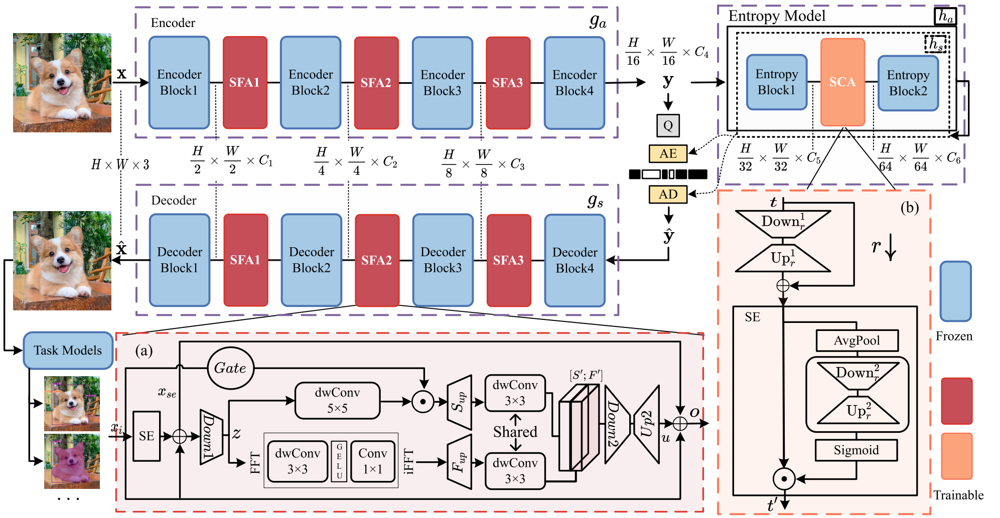
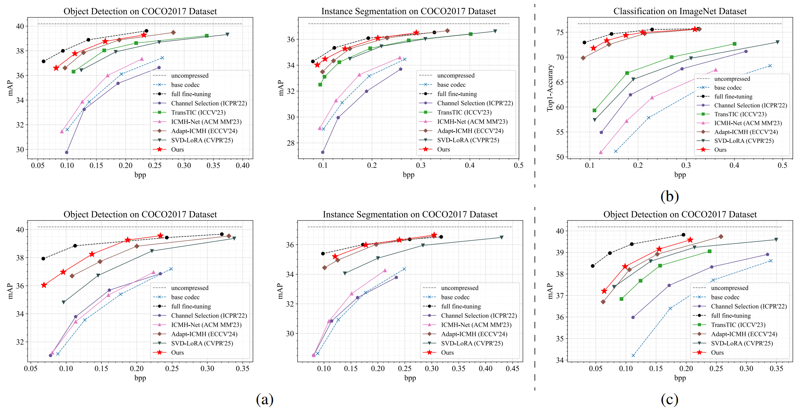
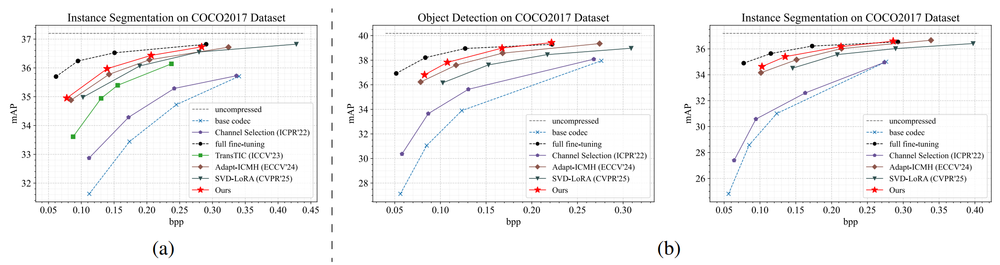

<div align="center">

# 🌟 What and Where to Adapt: Structure–Semantics Co-Tuning for Machine Vision Compression via Synergistic Adapters

**_Role-Guided Co-Tuning for Encoder-Decoder and Entropy Modeling!_**

[](https://arxiv.org/abs/2604.10017)
[](https://github.com/Brock-bit4/S2-CoT)
[](https://github.com/Brock-bit4/S2-CoT)
[](https://github.com/Brock-bit4/S2-CoT/blob/main/LICENSE)

**Shaobo Liu**, Haobo Xiong, Kai Liu*, Yuna Lin

School of Computer Science and Technology, Xidian University

</div>


## 📌 Abstract
Parameter-efficient fine-tuning of pre-trained codecs is a promising direction in image compression for human and machine vision. While most existing works have primarily focused on tuning the feature structure within the encoder-decoder backbones, the adaptation of the statistical semantics within the entropy model has received limited attention despite its function of predicting the probability distribution of latent features. Our analysis reveals that naive adapter insertion into the entropy model can lead to suboptimal outcomes, underscoring that the effectiveness of adapter-based tuning depends critically on the coordination between adapter type and placement across the compression pipeline. Therefore, we introduce **S**tructure–**S**emantics **Co**-**T**uning (**S²-CoT**), a novel framework that achieves this coordination via two specialized, synergistic adapters: the Structural Fidelity Adapter (SFA) and the Semantic Context Adapter (SCA). SFA is integrated into the encoder-decoder to preserve high-fidelity representations by dynamically fusing spatial and frequency information; meanwhile, the SCA adapts the entropy model to align with SFA-tuned features by refining the channel context for more efficient statistical coding. Through joint optimization, S²-CoT turns potential performance degradation into synergistic gains, achieving state-of-the-art results across four diverse base codecs with only a small fraction of trainable parameters, closely matching full fine-tuning performance.


## 🚀 Highlights
✅ **Novel Co-Tuning Strategy**: Theoretically \& Experimentally Validate the Structure–Semantics Synergy<br>
✅ **What and Where to Adapt**: Adapter Effectiveness Depends on Matching Type to Its Placement<br>
✅ **Ultra-Lightweight Adapter**: Structural Fidelity Adapter (SFA) and Semantic Context Adapter (SCA)<br>
✅ **Strong Performance**: Outperforms SOTA methods on classification, detection, segmentation<br>
✅ **Comprehensive Analysis**: Full analysis in [arXiv](https://arxiv.org/abs/2604.10017) main text & appendix


## 🕒 Updates
[TODO] Release more codes.  
[2026/04/14] Initial release of this repo.     


## 📂 Overview
<div align="center">

</div>


## 📊 Experimental Results
<div align="center">
<br>

</div>


## 📝 Updates & Errata
We will continuously update known typos, formula errors and description mistakes in the paper and repository.
- If you find any mistakes, typographical errors, or inconsistent experimental details, feel free to submit an Issue or pull request to notify us.
- All confirmed corrections will be recorded and updated in this section in real time.

### Record of Corrections
|      Date    |     Location    |     Error Description     |     Correction Content     |
|--------------|-----------------|---------------------------|----------------------------|
| 2026/07/06 | ①CvF->supp->Appendix.K->Tab.9<br>②arXiv.v1->Appendix.K->Tab.17 | Incorrect table value for trainable params of 'Ours' Method | Wrong:0.42 (0.35%)<br>***Right:0.67 (0.56%)*** |


## 📚 Dataset
The following datasets are used and needed to be downloaded:  
- COCO2017 Train/Val for Detection and Segmentation
- Kodak for Detection and Segmentation
- ImageNet for Classification


## 🧩 Example Train/Eval/Test
### Detection
```shell
python examples/detection_base.py -c config/detection_base.yaml -V -T
```
### Segmentation
```shell
python examples/segmentation_base.py -c config/segmentation_base.yaml -V -T
```


## ⚡ Ackownledgment
Our work is based on the framework of [CompressAI](https://github.com/InterDigitalInc/CompressAI) and [TransTIC](https://github.com/NYCU-MAPL/TransTIC).
Also, thanks to ICMH for their open source work [Adapt-ICMH](https://github.com/qingshi9974/ECCV2024-AdpatICMH).


## 📬 Contact
If you have any questions, suggestions, or collaboration opportunities, feel free to contact us via email:
- **Shaobo Liu**: shaoboo.liu@stu.xidian.edu.cn  
- **Haobo Xiong**: hbxiong@stu.xidian.edu.cn  
- **Kai Liu\*** (Corresponding Author): kailiu@mail.xidian.edu.cn  
- **Yuna Lin**: ynling@stu.xidian.edu.cn  


## 📖 Citation
If you find our work useful in your research, please cite our paper:

> #### ✦ THIS WORK ✦

***1. Google Scholar*** :
```bibtex
@inproceedings{liu2026gs,
  title={What and Where to Adapt: Structure-Semantics Co-Tuning for Machine Vision Compression via Synergistic Adapters},
  author={Liu, Shaobo and Xiong, Haobo and Liu, Kai and Lin, Yuna},
  booktitle={Proceedings of the IEEE/CVF Conference on Computer Vision and Pattern Recognition},
  pages={2813--2822},
  year={2026}
}
```
***2. CVPR 2026 open access*** :
```bibtex
@InProceedings{Liu_2026_CVPR,
    author    = {Liu, Shaobo and Xiong, Haobo and Liu, Kai and Lin, Yuna},
    title     = {What and Where to Adapt: Structure-Semantics Co-Tuning for Machine Vision Compression via Synergistic Adapters},
    booktitle = {Proceedings of the IEEE/CVF Conference on Computer Vision and Pattern Recognition (CVPR) Findings},
    month     = {June},
    year      = {2026},
    pages     = {2813-2822}
}
```
***3. arXiv*** :
```bibtex
@article{liu2026S2CoTarxiv,
  title={What and Where to Adapt: Structure–Semantics Co-Tuning for Machine Vision Compression via Synergistic Adapters},
  author={Liu, Shaobo and Xiong, Haobo and Liu, Kai and Lin, Yuna},
  journal={arXiv preprint arXiv:2604.10017},
  year={2026}
}
```

> #### ✦ OTHER WORKS ✦

***1. MDPI*** :
```bibtex
@Article{rs18060881,
 title={MambaLIC: State-Space Models for Efficient Remote Sensing Image Compression},
 author={Xiong, Haobo and Liu, Kai and Xiao, Huachao and Ding, Chongyang and Wang, Feiyang},
 journal={Remote Sensing},
 volume={18},
 year={2026},
 number={6},
 article-number={881},
 url={https://www.mdpi.com/2072-4292/18/6/881},
 issn={2072-4292},
 doi={10.3390/rs18060881}
}
```
